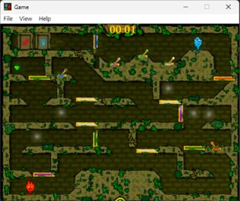
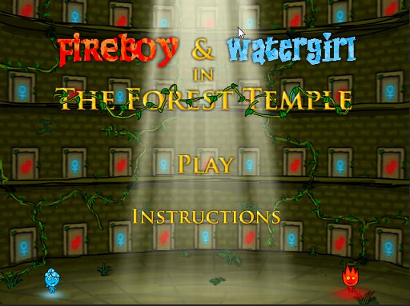
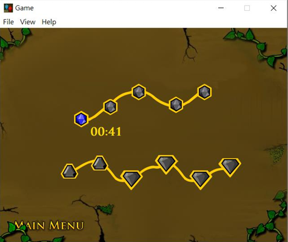

# Fireboy & Watergirl: The Forest Temple

A two-character cooperative puzzle game developed in C++ and Microsoft Foundation Classes (MFC), featuring custom collision detection, gravity, interactive mechanisms, and data-driven level configuration.

*Cooperative gameplay featuring character-specific movement, collectibles, switches, doors, and moving platforms.*

## Project Overview

This university project recreates the cooperative puzzle mechanics of *Fireboy & Watergirl* using the Leistungsstarkes Game Framework. Players coordinate two characters with different controls to collect diamonds, activate mechanisms, avoid hazards, and reach their respective exits.

## Screenshots

| Main menu | Level selection |
|---|---|
|  |  |

## Technical Highlights

| Project scale | Implementation |
|---|---|
| **11** playable puzzle levels | **14** C++/MFC classes |
| **277** configured gameplay instances | **28** source files |
| **3** application states | Initialization, gameplay, and game-over |

- **Architecture:** Organized the game around three application states and reusable gameplay components for characters, hazards, collectibles, switches, doors, rocks, and moving platforms.
- **Game systems:** Implemented `CRect` intersection-based collision detection, gravity, movable-rock physics, and dynamic switch/button-to-platform interactions.
- **Data structures:** Used `std::array` for fixed-size level and collision data, `std::vector` for trigger-to-platform bindings, and `std::map` for character-specific collectible counters.

Controls

| Character/action | Control |
|---|---|
| Fireboy movement | Left/Right arrow keys |
| Fireboy jump | Up arrow |
| Watergirl movement | A/D |
| Watergirl jump | W |
| Return to level selection | M |
| Menu and level selection | Mouse |

## Authors

Fu Lien and Yen-Te Liu, 2023

## My Contributions

- Designed reusable C++ gameplay components and connected level data,
  trigger bindings, and collectible counters through STL containers.
- Implemented rectangle-based collision detection, gravity, movable-rock
  behavior, and dynamic platform interactions.
- Configured and validated 11 puzzle levels containing 277 gameplay
  instances and 11 collision maps.

## Attribution

This non-commercial university project was created for educational purposes and is not affiliated with the publisher of the original *Fireboy & Watergirl* game.

Framework licensing, third-party notices, and the current asset-clearance
status are documented in [Third-Party Notices and Asset Provenance](THIRD_PARTY_NOTICES.md).
The bundled Cinzel font is distributed under the SIL Open Font License 1.1.
Because the repository does not yet establish redistribution rights for every
remaining image and audio file, no public binary release is currently provided.
